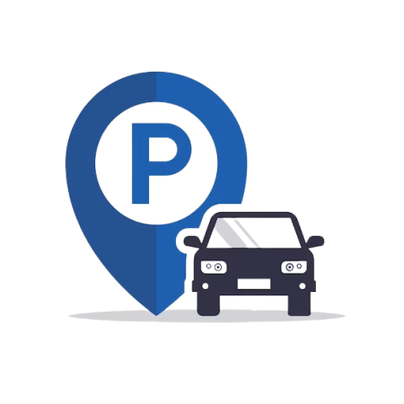

# E-Parking-Website
This project is part of an internship at Polda, focused on developing a web-based E-Parking system. 
The website allows users to perform check-in and check-out activities at parking facilities and manages real-time parking capacity.



> [Website Interface](#website-interface)

> [API Endpoint](#api-endpoint)

> [Installation and How To Use](#installation-and-how-to-use)

**Authors :**
| Name                              | NIM         | Universitas        |
| ----------------------------------|-------------|------------------- |
| Cherillya Rahmita Nurul Nucha     | 21106050029 | UIN Sunan Kalijaga |
| Qonita Muthmainnah                | 21106050018 | UIN Sunan Kalijaga |
| Levianita Rahmawati               | 21106050037 | UIN Sunan Kalijaga |

<br>

**Requirements & Tools :**
<br>
**Backend**: 


<br>
**Frontend**:


<br>
**Tools**: 


<br>


## Website Interface
### Input Form Interface
> Visitors are asked to fill in the Visitor Guest Book, the personal data information include: vehicle license plate, visitor's full name, address, visitor's purpose, and    visitor's telephone number.


### Choose Vehicle
> Choose vehicle after input data


### Checkin Done
> Notification if check in is success


### Vehicle Statistic
> The parking statistics page is divided into 2 types, namely for statistics for car and motorcycle vehicle types. This page displays information about the total initial parking capacity provided by POLDA DIY for visitors, the total visitors for each type of vehicle, and the total remaining parking capacity or that can be used by other visitors based on the type of vehicle to be selected.

|Motorcycle Statistic                                                                           |Car Statistic                                                            |
|-----------------------------------------------------------------------------------------------|-------------------------------------------------------------------------|
|||


### All Guest Data
> The visitor data page is divided into 3 types, namely combined data for all visitors using both cars and motorbikes, data for visitors using cars, and data for visitors using motorbikes.


|Motorcycle Guest Data                                                                        |Car Guest Data                                                           |
|---------------------------------------------------------------------------------------------|--------------------------------------------------------------------------|
|||


### Checkout
> Visitors who have completed their business in the DIY POLDA area are asked to check out. This aims to update the data in the system so that the available parking capacity can be displayed in real-time. When checking out, visitors are asked to select the type of vehicle that matches the previous choice.


### Checkout Form
> After that, the system will ask visitors to enter the vehicle license plate number to update the parking capacity in the system.


### Checkout Done
> Notification if check out is success.


## API Endpoint
We created this API to make managing guest data simple and efficient. It provides functionality for recording guest check-ins and check-outs, tracking capacity, and viewing statistics based on different criteria.

|Endpoint    |Method |Description                                                                                         |
|-------------|--------|--------------------------------------------------------------------------------------------------|
|`/createTamu`|`POST`  |Create new guest data                                                                             |
|`/guestData`|`GET`    |Display all stored guest data                                                                     |
|`/guestByType`|`POST` |View guest information based on the type of vehicle                                               |
|`/kapasitas`|`POST`   |Track total and available parking capacity                                                        |
|`/statistik`|`POST`   |Display statistical data on total capacity, total visitors, and available capacity by vehicle type|
|`/checkoutTamu`|`POST`|Show a message indicating whether a guest has checked out or not                                  |


## Installation and How to Use
**1. Clone or download the source code**
   - Clone the repository using the following command:
     ```bash
     git clone [repository-URL]
     ```
   - Or, download the zip file and extract it to your desired folder

**2. Install dependencies**
  - Navigate to the project directory using the terminal or command prompt:
    ```bash
    cd e-parking-website
    ```
  - Install all dependencies listed in `package.json` using:
    ```bash
    npm install
    ```

**3. Configure the environment file**
  - Rename the `.env.example` file to `.env`
  - Ensure the variables in the `.env` file are configured correctly, such as user, password, database name, host, port, and API url

**4. Create the database**
  - Open phpMyAdmin or other MySQL client
  - Create a new database named `db-parking`

**5. Run the frontend**
  - To start the frontend development server, use the command:
    ```bash
    npm run start-dev
    ```
  - This will run the server using the `webpack.dev.js` configuration

**6. Run the backend**
  - To run the backend server with hot reload using `nodemon`, use the command:
    ```bash
    npm run dev
    ```
  - The server will use `server.js` as the entry point

**7. Access the application**
  - Access the application through the URL provided by the `webpack-dev-server`, that is http://localhost:9000
